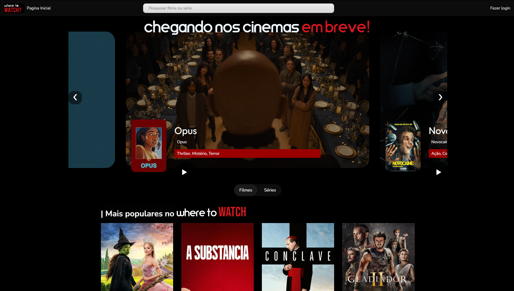
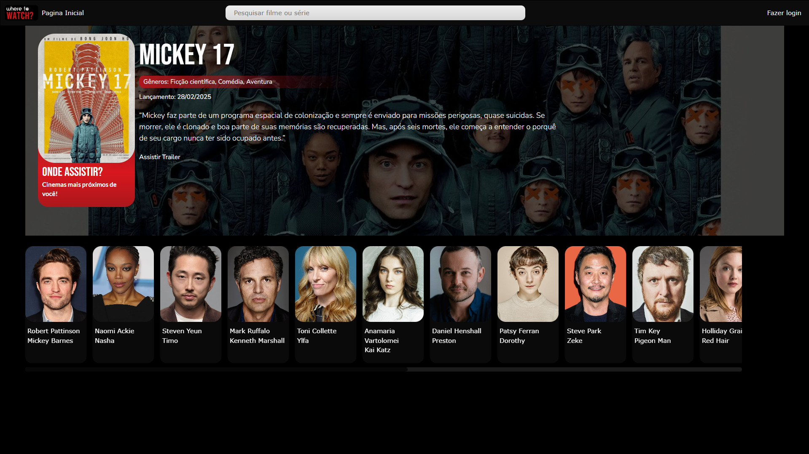

Olá! Sejam bem vindos ao meu primeiro projeto solo, o Where to Watch.
# Where You Watch 🎬📺

O **Where You Watch** é um projeto pessoal desenvolvido com o objetivo de ajudar usuários a encontrarem rapidamente onde seus filmes e séries favoritos estão disponíveis para assistir. A ideia surgiu de uma dor real: perder tempo procurando em qual plataforma um título está disponível.
Com um design responsivo, interface amigável e integração com a API do TMDB, o WYWatch oferece uma experiência prática, rápida e visualmente envolvente.

---

## 🔍 Funcionalidades atuais

- Busca de filmes e séries via **API do TMDB**;
- Exibição de **provedores oficiais** (streaming e aluguel);
- Detalhes sobre **trailer**, **elenco principal**, sinopse e nota de avaliação;
- **Sistema de login e cadastro de usuários**;
- Interface com **modo escuro e claro**;
- Identidade visual exclusiva, com layout responsivo e moderno.

---

## 🚧 Funcionalidades futuras (em desenvolvimento)

- Lista "Assistir mais tarde" personalizada por usuário;
- Avaliação de filmes e séries pelos próprios usuários;
- Recomendações baseadas em preferências e histórico;
- Links diretos para a página do título na plataforma de streaming;
- Sistema de feedback e IA para sugestões inteligentes;
- Página de atores e diretores favoritos com outros trabalhos relacionados.

---

## 🛠 Tecnologias utilizadas

- **HTML, CSS, JavaScript** (Front-end)
- **TMDB API** para dados de filmes/séries
- **Git & GitHub** para controle de versão
- **CorelDRAW** e ferramentas de design para identidade visual

---

## 📸 Demonstração do WYWatch

### 🔍 Página inicial (Homepage)

A tela inicial permite ao usuário pesquisar rapidamente por filmes ou séries e visualizar os destaques em cartaz.

---

### 🎬 Página de detalhes do filme

Exibe informações completas do filme: título, sinopse, trailer, elenco principal e onde assistir.

---

## 💡 Inspiração

Esse projeto nasceu da minha vontade de transformar uma necessidade cotidiana em uma solução digital completa. O WYWatch não é apenas um agregador de catálogos de streaming — é uma plataforma pensada para evoluir com os usuários.

---

## 📌 Como contribuir

Atualmente este é um projeto pessoal, mas estou aberto a sugestões, ideias ou colaborações que possam melhorá-lo. Sinta-se à vontade para abrir uma issue ou entrar em contato!

---

## 👨‍💻 Autor

**João Vitor Alves de Alencar**  
Desenvolvedor Front-end e entusiasta em UX, API e produtos digitais.

[LinkedIn](https://www.linkedin.com/in/joaoalvesz)

---

## 📝 Copyright

Todos os direitos reservados © 2025 João Vitor Alves de Alencar

Este código-fonte é apenas para fins de demonstração. A reprodução, cópia, modificação, distribuição ou qualquer forma de reutilização, total ou parcial, sem autorização prévia do autor, é estritamente proibida.
