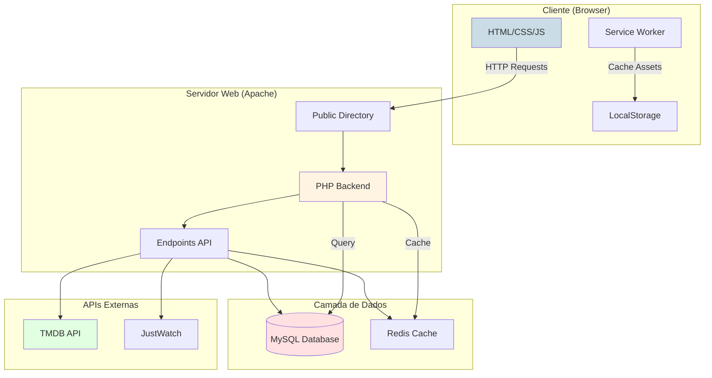
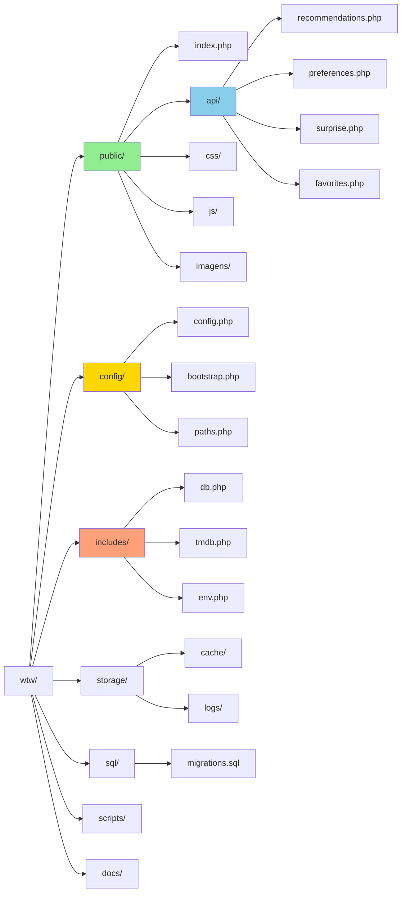
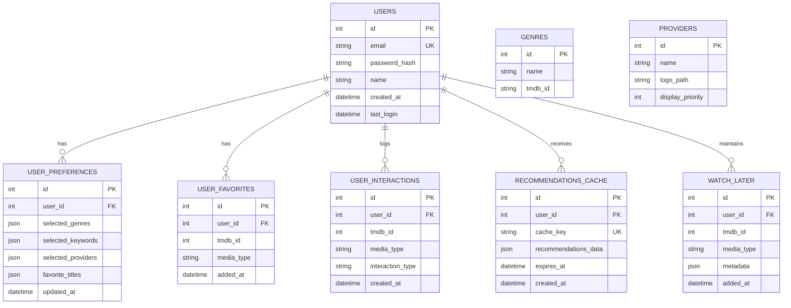
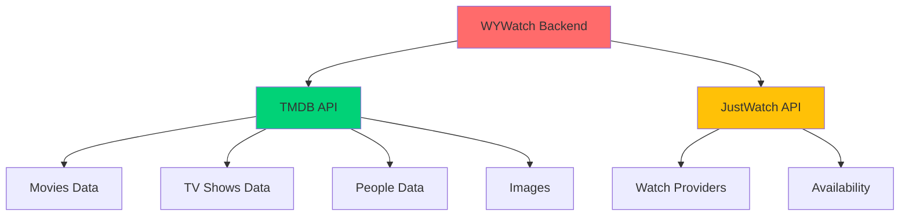
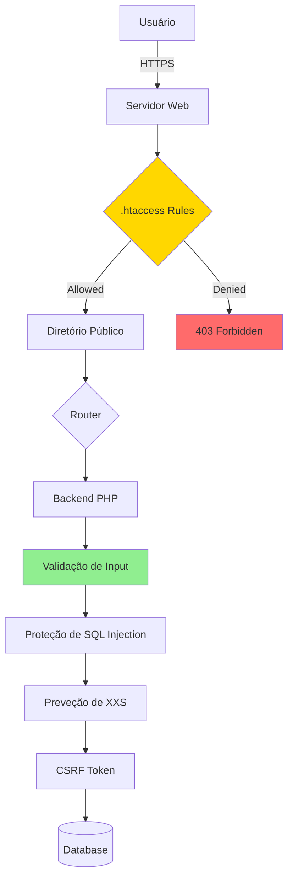

# 🎬 Where You Watch • [whereuwatch.com](http://www.whereuwatch.com)

<div align="center">


**Play no que você ama, sem perder tempo**

[🌐 whereuwatch.com](http://www.whereuwatch.com) • [📱 LinkedIn](https://www.linkedin.com/in/joaoalvesz)

[](https://php.net)
[](https://javascript.com)
[](https://mysql.com)
[](https://www.themoviedb.org)

</div>

---

## 📖 Sobre o Projeto

O **Where You Watch (WYWatch)** é uma plataforma web completa desenvolvida para resolver um problema cotidiano: **descobrir onde assistir filmes e séries** entre os diversos serviços de streaming disponíveis.

Desenvolvi este projeto ao longo de quase **2 anos** como projeto pessoal.

---

## 🏗️ Arquitetura do Sistema

### Visão Geral




### Estrutura de Diretórios



---

## 📊 Diagrama de Banco de Dados



---

## ✨ Funcionalidades Principais

### 🏠 Página Inicial Personalizada

<table>
  <tr>
    <td width="50%">
      
    </td>
    <td width="50%">
      
    </td>
  </tr>
  <tr>
    <td align="center"><em>Layout em grade com recomendações</em></td>
    <td align="center"><em>Layout em linhas com categorias</em></td>
  </tr>
</table>

**Recursos:**
- ✅ Recomendações personalizadas baseadas em preferências
- ✅ Seções dinâmicas: Tendências, Populares, Melhor Avaliados
- ✅ Navegação fluida
- ✅ Cards interativos com lazy loading

---

### 🎬 Página de Título (Filme/Série)

<div align="center">
  
</div>

<table>
  <tr>
    <td width="50%">
      
    </td>
    <td width="50%">
      
    </td>
  </tr>
</table>

**Informações Detalhadas:**
- ✅ Trailer integrado (YouTube Embed)
- ✅ Sinopse, gêneros e avaliação TMDB
- ✅ Elenco principal e ficha técnica
- ✅ Provedores de streaming disponíveis (Brasil)
- ✅ Links diretos para as plataformas
- ✅ Temporadas e episódios (para séries)

---

### 🎭 Página de Pessoa (Ator/Diretor)

<div align="center">
  
</div>

<table>
  <tr>
    <td width="50%">
      
    </td>
    <td width="50%">
      
    </td>
  </tr>
</table>

**Recursos:**
- 📋 Biografia completa
- 🎬 Filmografia organizada por ano
- 📅 Linha do tempo de carreira com filtros
- 👥 Colaborações frequentes
- 🔗 Links para redes sociais oficiais

---

### 🔍 Busca e Navegação

<table>
  <tr>
    <td width="50%">
      
    </td>
    <td width="50%">
      
    </td>
  </tr>
  <tr>
    <td align="center"><em>Busca instantânea com resultados em tempo real</em></td>
    <td align="center"><em>Exploração por gêneros e categorias</em></td>
  </tr>
</table>

**Funcionalidades:**
- 🔎 Busca instantânea via TMDB API (`/search/multi`)
- 🎯 Resultados em tempo real com debounce
- 🏷️ Filtros por gênero, tipo e ano
- 📊 Ordenação por popularidade, avaliação ou data
- ⚡ AbortController para cancelar buscas antigas

---

### 📺 Navegação por Provedores

<div align="center">
  
</div>

**Recursos:**
- 📱 Navegação por streaming (Netflix, Prime Video, Disney+, etc.)
- 🎯 Catálogo personalizado de cada provedor
- 🔀 Filtros combinados (gênero + provedor)
- 🔄 Atualização automática de disponibilidade

---

### 👤 Perfil do Usuário

<div align="center">
  
</div>

**Gerenciamento:**
- 📊 Estatísticas pessoais (favoritos, preferências, plataformas)
- ⭐ Lista de títulos favoritos
- 🎯 Configuração de preferências

---

### 🎲 Modo "Surpreenda-me"

<div align="center">
  
</div>

**Descoberta Aleatória:**
- 🎰 Roleta animada de filmes/séries
- 🎯 Recomendação personalizada baseada em preferências
- 💡 Insight do motivo da recomendação
- 🎬 Suporte para filmes e séries
- ✨ Experiência visual com transições suaves

---

### 🔐 Sistema de Login

<div align="center">
  
</div>

**Autenticação:**
- 🔒 Sistema com hash
- 🔑 Recuperação de senha
- 📱 Design responsivo

---

## 🛠️ Stack Tecnológico

### Backend

**Tecnologias:**
- **PHP 8.0+**: Backend principal
- **MySQL 5.7+**: Banco de dados relacional
- **Apache 2.4+**: Servidor web com mod_rewrite
- **Composer**: Gerenciador de dependências (futuro)

### Frontend

**Tecnologias:**
- **HTML5**: 
- **CSS3**
- **JavaScript**
- **Service Worker**: Cache de assets
- **LocalStorage**

### APIs e Integrações



---

## 📡 Endpoints da API

### Recomendações

```
POST /api/recommendations.php
```

**Request:**
```json
{
  "user_id": 123,
  "limit": 20,
  "media_type": "movie"
}
```

**Response:**
```json
{
  "success": true,
  "recommendations": [
    {
      "tmdb_id": 550,
      "title": "Fight Club",
      "score": 8.5,
      "reason": "Based on your preferences"
    }
  ],
  "cached": false
}
```

---

## 🔐 Segurança

### Camadas de Proteção



### Medidas de Segurança

- ✅ **Diretório público isolado**: Apenas `/public` acessível via web
- ✅ **Proteção .env**: `.htaccess` bloqueia acesso direto
- ✅ **Prepared Statements**: Proteção contra SQL Injection
- ✅ **Sanitização de Input**: Validação em todas as entradas
- ✅ **Headers de Segurança**: CSP, X-Frame-Options, etc.
- ✅ **Password Hashing**: bcrypt com salt
- ✅ **Session Security**: Regeneração de ID, cookies seguros

---

## 🚀 Funcionalidades Futuras

### Roadmap 2026

### Em Desenvolvimento
- [ ] Sistema de **avaliação de filmes e séries**
- [ ] Histórico de títulos assistidos

### Planejado
- [ ] IA para **recomendações inteligentes baseadas em comportamento**
- [ ] Painel de estatísticas pessoais (tempo assistido, gêneros preferidos)
- [ ] Integração com **notícias de entretenimento**
- [ ] **Ranking semanal por streaming**
- [ ] Sistema de notificações (novos lançamentos, títulos removidos)

---

## 💡 Por Que Este Projeto?

O WYWatch nasceu da vontade de transformar um incômodo meu: procurar o que assistir onde assistir em uma solução digital completa.  

---


## 📦 Instalação e Deploy

### Pré-requisitos

- PHP 8.0 ou superior
- MySQL 5.7 ou superior
- Apache 2.4+ com mod_rewrite

### Instalação Local

```bash
# 1. Clone o repositório
git clone https://github.com/alzolansk/where-to-watch.git
cd where-to-watch

# 2. Configure o ambiente
cp .env.example .env
# Edite o .env com suas credenciais

# 3. Importe o banco de dados
mysql -u root -p < sql/20251005_recommendation_tables.sql
mysql -u root -p < sql/20251107_onboarding_preferences.sql
mysql -u root -p < sql/20260115_recommendations_cache.sql

# 4. Configure as permissões
chmod 755 storage/cache
chmod 755 storage/logs

# 5. Popule dados iniciais
php scripts/seed_genres.php
php scripts/seed_providers.php

# 6. Acesse no navegador
# http://localhost/whereyouwatch/public
```
---

## 📄 Licença

**© 2025 João Vitor Alves de Alencar - Todos os direitos reservados**

Este é um projeto pessoal e proprietário. A reprodução total ou parcial, distribuição, modificação ou uso comercial do código-fonte, design ou conteúdo deste projeto sem autorização expressa do autor é **proibida**.

### Uso de Dados TMDB

Este produto usa a API TMDB, mas não é endossado ou certificado pela TMDB.

<div align="center">
  
</div>

## 👨‍💻 Autor

<div align="center">

**João Vitor Alves de Alencar**

[](https://www.linkedin.com/in/joaoalvesz)
[](https://github.com/joaoalvesz)
</div>

## 📈 Estatísticas do Projeto

<div align="center">


</div>


<div align="center">

**Desenvolvido por [João Vitor Alves de Alencar](https://linkedin.com/in/joaoalvesz)**

</div>
