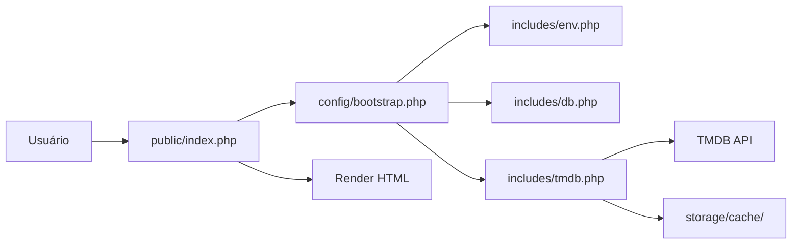

# 🎬 Where You Watch - Sistema de Recomendações Personalizadas


Sistema inteligente de recomendações de filmes e séries com **algoritmo de personalização**, integrado com **TMDB API**.

## 📋 Índice

- [🎯 Sobre](#-sobre)
- [✨ Funcionalidades](#-funcionalidades)
- [🏗️ Arquitetura](#️-arquitetura)
- [📂 Estrutura do Projeto](#-estrutura-do-projeto)
- [💻 Requisitos](#-requisitos)
- [🚀 Instalação](#-instalação)
- [⚙️ Configuração](#️-configuração)
- [🎮 Uso](#-uso)
- [🔒 Segurança](#-segurança)
- [📦 Deploy](#-deploy)
- [🐛 Troubleshooting](#-troubleshooting)
- [📚 Documentação Adicional](#-documentação-adicional)

---

## 🎯 Sobre

O **Where You Watch** é uma plataforma completa de descoberta de conteúdo que:

### 🎭 **Para Usuários**
- 🎬 Descobre filmes e séries baseados em **suas preferências reais**
- 🎲 Sistema "**Surpreenda-me**" com roleta interativa
- 👤 **Onboarding personalizado** para novos usuários
- 📊 Rastreamento de interações para melhorar recomendações
- 🎯 Filtragem por provedores de streaming (Netflix, Prime Video, etc.)

### 🔧 **Para Desenvolvedores**
- 🏗️ **Arquitetura moderna** com padrão bootstrap
- 🔐 **Segurança em camadas** (pasta `public/`, .htaccess, headers)
- ⚡ **Cache inteligente** de requisições TMDB
- 📝 **Logging estruturado** para debug
---

## ✨ Funcionalidades

### 🎨 **Interface do Usuário**
- ✅ **Dashboard Responsivo** - Navegação intuitiva em qualquer dispositivo
- ✅ **Sistema de Busca** - Pesquisa avançada de filmes e séries
- ✅ **Páginas de Detalhes** - Informações completas de títulos
- ✅ **Catálogo por Gênero** - Explore por categorias
- ✅ **Catálogo por Provedor** - Filtre por streaming disponível
- ✅ **Perfil do Usuário** - Gerenciamento de preferências

### 🤖 **Sistema de Recomendações**
- ✅ **Algoritmo Híbrido** - Combina gêneros, pessoas e popularidade
- ✅ **Pesos Dinâmicos** - Aprende com interações do usuário
- ✅ **Cache de Recomendações** - Performance otimizada
- ✅ **Filtragem Inteligente** - Remove conteúdo já visto/rejeitado
- ✅ **Suporte Multi-região** - Disponibilidade por país (BR default)

### 🎲 **Surpreenda-me (Roleta)**
- ✅ **Roleta Visual** - Interface com posters rotativos
- ✅ **Múltiplos Algoritmos** - Aleatório puro, balanceado, trending
- ✅ **Filtragem Avançada** - Por gênero, ano, provedor, avaliação
- ✅ **Telemetria** - Rastreamento de impressões e skips
- ✅ **Performance** - Carregamento rápido com cache

### 👤 **Onboarding Personalizado**
- ✅ **Fluxo Multi-step** - Gêneros → Títulos → Pessoas → Provedores
- ✅ **Sugestões Inteligentes** - Baseadas em trending do TMDB
- ✅ **Validação Completa** - Garante dados consistentes
- ✅ **Persistência** - Salva progresso automaticamente
- ✅ **Timestamp** - Registra conclusão do onboarding

### 📊 **Sistema de Telemetria**
- ✅ **Rastreamento de Interações** - Views, clicks, likes, dislikes
- ✅ **Pesos Customizáveis** - Ajuste importância de cada ação
- ✅ **Tipos Múltiplos** - 10+ tipos de interação suportados
- ✅ **API RESTful** - Endpoint dedicado para analytics

---

## 🏗️ Arquitetura

### **Padrão Bootstrap Centralizado**

O projeto utiliza um **padrão de inicialização centralizado** que garante consistência e segurança:

```php
// Todos os arquivos começam com:
require_once __DIR__ . '/../config/bootstrap.php';

// O bootstrap carrega automaticamente:
// ✅ Paths (ROOT_PATH, PUBLIC_PATH, etc.)
// ✅ Environment (.env via wyw_env())
// ✅ Database (PDO + mysqli)
// ✅ TMDB API (com cache)
// ✅ Session Management
// ✅ Error Handling
```

### **Camadas de Segurança**

```
┌─────────────────────────────────────┐
│  Internet (Acesso Público)          │
└──────────────┬──────────────────────┘
               │
┌──────────────▼──────────────────────┐
│  public/ (Document Root)            │ ◄─ ÚNICA pasta acessível
│  ├── .htaccess (Headers + Cache)    │
│  ├── index.php                      │
│  └── api/                           │
└──────────────┬──────────────────────┘
               │
┌──────────────▼──────────────────────┐
│  config/bootstrap.php               │ ◄─ Inicialização
│  ├── paths.php                      │
│  └── config.php                     │
└──────────────┬──────────────────────┘
               │
┌──────────────▼──────────────────────┐
│  includes/ (.htaccess = Deny All)   │ ◄─ Bibliotecas protegidas
│  ├── env.php                        │
│  ├── db.php (PDO + mysqli)          │
│  └── tmdb.php (API Client)          │
└──────────────┬──────────────────────┘
               │
┌──────────────▼──────────────────────┐
│  storage/ (.htaccess = Deny All)    │ ◄─ Dados protegidos
│  ├── logs/                          │
│  └── cache/                         │
└─────────────────────────────────────┘
```

### **Fluxo de Requisição**



---

---

## 📂 Estrutura do Projeto

```
wtw/
├── 📁 public/                          ◄─ ÚNICO diretório acessível via web
│   ├── 📄 .htaccess                   ← Security headers, cache, compression
│   ├── 📄 index.php                   ← Página principal (home personalizada)
│   ├── 📄 dashboard.php               ← Navbar/Menu global
│   ├── 📄 login.php                   ← Login de usuários
│   ├── 📄 new-login.php               ← Cadastro de novos usuários
│   ├── 📄 filme.php                   ← Detalhes de filme/série
│   ├── 📄 person.php                  ← Perfil de ator/diretor
│   ├── 📄 genres.php                  ← Catálogo por gênero
│   ├── 📄 providers.php               ← Catálogo por streaming
│   ├── 📄 profile.php                 ← Perfil do usuário
│   ├── 📄 search.php                  ← Busca de conteúdo
│   ├── 📄 surpreenda.php              ← Roleta "Surpreenda-me"
│   ├── 📄 landing.html                ← Landing page
│   ├── 📄 logout.php                  ← Logout
│   │
│   ├── 📁 api/                        ← APIs REST (JSON)
│   │   ├── 📄 home-personalized.php  ← Recomendações da home
│   │   ├── 📄 recommendations.php    ← Engine de recomendações
│   │   ├── 📄 recommendations-meta.php ← Metadados (gêneros, provedores)
│   │   ├── 📄 surprise.php           ← Backend da roleta
│   │   ├── 📄 roulette-posters.php   ← Posters para roleta
│   │   ├── 📄 onboarding.php         ← Onboarding de novos usuários
│   │   ├── 📄 preferences.php        ← CRUD de preferências
│   │   └── 📄 interactions.php       ← Telemetria de interações
│   │
│   ├── 📁 css/                        ← Estilos CSS
│   │   ├── 📄 brand.css              ← Design system
│   │   ├── 📄 style.css              ← Estilos globais
│   │   ├── 📄 movie.css              ← Página de filme
│   │   ├── 📄 genres.css             ← Catálogo de gêneros
│   │   ├── 📄 providers.css          ← Catálogo de provedores
│   │   ├── 📄 profile.css            ← Perfil do usuário
│   │   ├── 📄 surpreenda.css         ← Roleta
│   │   └── ...
│   │
│   ├── 📁 js/                         ← Scripts JavaScript
│   │   ├── 📄 script.js              ← Funcionalidades gerais
│   │   ├── 📄 filme.js               ← Detalhes de filme
│   │   ├── 📄 genres.js              ← Catálogo de gêneros
│   │   ├── 📄 providers.js           ← Catálogo de provedores
│   │   ├── 📄 profile.js             ← Perfil do usuário
│   │   ├── 📄 surpreenda.js          ← Lógica da roleta
│   │   ├── 📄 onboarding.js          ← Onboarding interativo
│   │   ├── 📄 recommendations.js     ← Carregamento de recomendações
│   │   └── ...
│   │
│   └── 📁 imagens/                    ← Assets estáticos
│
├── 📁 config/                          ◄─ Configurações (NÃO acessível)
│   ├── 📄 .htaccess                   ← Deny from all
│   ├── 📄 bootstrap.php               ← ⭐ CORE: Inicialização centralizada
│   ├── 📄 paths.php                   ← Constantes de paths
│   └── 📄 config.php                  ← Configurações legadas (mysqli)
│
├── 📁 includes/                        ◄─ Bibliotecas PHP (NÃO acessível)
│   ├── 📄 .htaccess                   ← Deny from all
│   ├── 📄 env.php                     ← ⭐ Carregamento de .env
│   ├── 📄 db.php                      ← ⭐ Conexões PDO + mysqli
│   ├── 📄 tmdb.php                    ← ⭐ Cliente TMDB API (compatível InfinityFree)
│   └── 📄 personalization-cache.php   ← Cache de preferências
│
├── 📁 storage/                         ◄─ Dados gerados (NÃO acessível)
│   ├── 📄 .htaccess                   ← Deny from all
│   │
│   ├── 📁 logs/                       ← Logs da aplicação
│   │   ├── 📄 .gitkeep
│   │   ├── 📄 php-errors.log         ← Erros PHP
│   │   ├── 📄 api-home.log           ← Logs da API home
│   │   └── 📄 api-*.log              ← Outros logs de API
│   │
│   └── 📁 cache/                      ← Cache de requisições
│       ├── 📄 .gitkeep
│       ├── 📄 wyw_*.json             ← Cache TMDB (JSON)
│       └── 📄 personalization_*.json  ← Cache de preferências
│
├── 📁 sql/                             ◄─ Migrations e schemas
│   ├── 📄 20251005_recommendation_tables.sql
│   ├── 📄 20251107_onboarding_preferences.sql
│   └── 📄 20260115_recommendations_cache.sql
│
├── 📁 scripts/                         ◄─ Scripts de manutenção
│   ├── 📄 seed_genres.php            ← Popular tabela de gêneros
│   ├── 📄 seed_providers.php         ← Popular tabela de provedores
│   ├── 📄 fetch_availability.php     ← Buscar disponibilidade
│   └── 📄 update_availability.php    ← Atualizar disponibilidade
│
├── 📁 docs/                            ◄─ Documentação técnica
│   ├── 📄 README.md                   ← Este arquivo
│   ├── 📄 MIGRACAO_CONCLUIDA.md      ← Histórico da migração para public/
│   ├── 📄 CHANGELOG_INFINITYFREE.md  ← Correções de compatibilidade
│   └── 📄 CHECKLIST_IMPLEMENTACAO.md ← Guia de deploy
│
├── 📄 .env.example                     ◄─ Template de configuração
├── 📄 .gitignore                       ◄─ Arquivos ignorados pelo Git
├── 📄 .htaccess                        ◄─ Proteção de arquivos sensíveis (raiz)
└── 📄 README.md                        ◄─ Quick start (raiz)
```
```

### **� Principais Arquivos**

| Arquivo | Propósito | Importância |
|---------|-----------|-------------|
| `config/bootstrap.php` | ⭐ Inicialização centralizada | CRÍTICO |
| `includes/env.php` | Carregamento de `.env` | CRÍTICO |
| `includes/db.php` | Conexões PDO + mysqli | CRÍTICO |
| `includes/tmdb.php` | Cliente TMDB API | CRÍTICO |
| `public/.htaccess` | Security headers, cache | IMPORTANTE |
| `.env` | Configurações sensíveis | CRÍTICO |

---

## �💻 Requisitos

### **Desenvolvimento Local**

| Requisito | Versão Mínima | Recomendado |
|-----------|---------------|-------------|
| **PHP** | 7.4 | 8.0+ |
| **MySQL** | 5.7 | 8.0+ |
| **Apache** | 2.4 | 2.4+ |
| **Composer** | 2.0 | 2.x (opcional) |

#### **Extensões PHP Obrigatórias:**
```bash
✅ pdo_mysql      # Conexão com banco
✅ curl           # Requisições HTTP
✅ json           # Manipulação JSON
✅ mbstring       # Strings multibyte
✅ mysqli         # Suporte mysqli (legado)
✅ session        # Gerenciamento de sessões
```

#### **Módulos Apache Obrigatórios:**
```bash
✅ mod_rewrite    # URL rewriting
✅ mod_headers    # Security headers
✅ mod_deflate    # Compressão gzip (opcional)
✅ mod_expires    # Cache headers (opcional)
```

### **Produção (InfinityFree)**

| Especificação | Valor |
|---------------|-------|
| **PHP** | 8.3.19 |
| **MySQL** | Via phpMyAdmin |
| **Espaço** | Ilimitado |
| **Bandwidth** | Ilimitado |

#### ⚠️ **Limitações InfinityFree:**
```diff
- ❌ curl_multi_* (não suportado)
+ ✅ Solução: Implementado requests sequenciais em tmdb.php
- ❌ fsockopen() limitado
+ ✅ Solução: Usar curl() sempre que possível
- ❌ exec(), shell_exec() desabilitados
+ ✅ Solução: Tudo feito via PHP puro
```

---

## 🚀 Instalação

### **1. Clone o Repositório**

```bash
git clone https://github.com/alzolansk/where-to-watch.git
cd where-to-watch/wtw
```

### **2. Configure o Ambiente**

```bash
# Copie o arquivo de exemplo
cp .env.example .env

# Edite com suas credenciais
# Windows:
notepad .env

# Linux/Mac:
nano .env
```

### **3. Configure o `.env`**

```bash
# ========================================
# APLICAÇÃO
# ========================================
APP_ENV=development              # production em produção
APP_DEBUG=true                   # false em produção
APP_URL=http://localhost/WhereToWatch/wtw/public

# ========================================
# BANCO DE DADOS
# ========================================
DB_HOST=localhost                # ou 127.0.0.1
DB_NAME=db_login                 # nome do seu banco
DB_USER=root                     # seu usuário MySQL
DB_PASS=                         # sua senha MySQL (vazio no XAMPP)

# ========================================
# TMDB API
# ========================================
# Obtenha em: https://www.themoviedb.org/settings/api
TMDB_API_KEY=sua_chave_aqui
TMDB_BEARER=seu_bearer_aqui
TMDB_API_BASE=https://api.themoviedb.org/3

# ========================================
# CACHE E LOGS
# ========================================
CACHE_DRIVER=file
CACHE_TTL=3600
LOG_CHANNEL=file
LOG_LEVEL=debug                  # error em produção
```

### **4. Importe o Banco de Dados**

```bash
# Via linha de comando:
mysql -u root -p db_login < sql/20251005_recommendation_tables.sql
mysql -u root -p db_login < sql/20251107_onboarding_preferences.sql
mysql -u root -p db_login < sql/20260115_recommendations_cache.sql

# Ou via phpMyAdmin:
# 1. Acesse http://localhost/phpmyadmin
# 2. Crie database "db_login"
# 3. Importe os arquivos .sql da pasta sql/
```

### **5. Popule Dados Iniciais**

```bash
# Via navegador (recomendado):
http://localhost/WhereToWatch/wtw/scripts/seed_genres.php
http://localhost/WhereToWatch/wtw/scripts/seed_providers.php

# Ou via linha de comando:
php scripts/seed_genres.php
php scripts/seed_providers.php
```

### **6. Configure Permissões (Linux/Mac)**

```bash
# Dar permissão de escrita para storage/
chmod -R 775 storage/
chmod -R 664 storage/logs/*.log
chmod -R 664 storage/cache/*.json

# Proteger .env
chmod 600 .env
```

### **7. Acesse o Sistema**

```
🌐 Local: http://localhost/WhereToWatch/wtw/public/
📱 Mobile: http://seu-ip-local/WhereToWatch/wtw/public/
```

---

## ⚙️ Configuração

### **Configuração do Apache**

#### **Opção 1: Virtual Host (Recomendado)**

Crie um arquivo `httpd-vhosts.conf`:

```apache
<VirtualHost *:80>
    ServerName whereyouwatch.local
    DocumentRoot "C:/xampp/htdocs/WhereToWatch/wtw/public"
    
    <Directory "C:/xampp/htdocs/WhereToWatch/wtw/public">
        Options -Indexes +FollowSymLinks
        AllowOverride All
        Require all granted
    </Directory>
    
    ErrorLog "logs/whereyouwatch-error.log"
    CustomLog "logs/whereyouwatch-access.log" common
</VirtualHost>
```

Adicione ao `hosts`:
```
127.0.0.1    whereyouwatch.local
```

Acesse: `http://whereyouwatch.local`

#### **Opção 2: Subpasta (Atual)**

Acesse: `http://localhost/WhereToWatch/wtw/public/`

### **Variáveis de Ambiente**

Todas as configurações sensíveis devem estar no `.env`:

| Variável | Descrição | Exemplo |
|----------|-----------|---------|
| `APP_ENV` | Ambiente (development/production) | `development` |
| `APP_DEBUG` | Modo debug (true/false) | `true` |
| `DB_HOST` | Host do MySQL | `localhost` |
| `DB_NAME` | Nome do banco | `db_login` |
| `DB_USER` | Usuário MySQL | `root` |
| `DB_PASS` | Senha MySQL | `` |
| `TMDB_API_KEY` | Chave API TMDB | `dc3b4144ae...` |
| `CACHE_TTL` | Tempo de cache (segundos) | `3600` |
| `LOG_LEVEL` | Nível de log | `debug` |

### **Funções Auxiliares do `.env`**

```php
// Carregar variável do .env
$apiKey = wyw_env('TMDB_API_KEY');

// Com valor padrão
$debug = wyw_env('APP_DEBUG', false);

// Verificar se existe
if (wyw_env('TMDB_API_KEY')) {
    // API configurada
}
```

---

## 🎮 Uso

### **Estrutura de Uma Página Típica**

```php
<?php
// 1. Carregar bootstrap (SEMPRE primeiro)
require_once __DIR__ . '/../config/bootstrap.php';

// 2. Inicializar mysqli se necessário (código legado)
if (!isset($conexao)) {
    $host = wyw_env('DB_HOST', 'localhost');
    $database = wyw_env('DB_NAME', 'db_login');
    $user = wyw_env('DB_USER', 'root');
    $password = wyw_env('DB_PASS', '');
    $conexao = new mysqli($host, $user, $password, $database);
    $conexao->set_charset('utf8mb4');
}

// 3. Sua lógica aqui
// Session já está iniciada via bootstrap
// PDO disponível via get_pdo()
// TMDB API disponível via tmdb_get()
?>

<!DOCTYPE html>
<html>
<head>
    <title>Minha Página</title>
    <link rel="stylesheet" href="css/brand.css">
</head>
<body>
    <?php include_once('dashboard.php'); ?>
    
    <main>
        <!-- Seu conteúdo -->
    </main>
    
    <script src="js/script.js"></script>
</body>
</html>
```

### **Usando a API TMDB**

```php
// Buscar filme por ID
$movie = tmdb_get('movie/550'); // Fight Club

// Buscar com parâmetros
$trending = tmdb_get('trending/movie/week', [
    'language' => 'pt-BR',
    'region' => 'BR'
]);

// Múltiplas requisições (usa cache automático)
$urls = [
    'movie/popular',
    'tv/popular',
    'trending/all/day'
];
$results = tmdb_get_bulk($urls);

// ✅ Compatível com InfinityFree (sem curl_multi_*)
```

### **Usando o Sistema de Cache**

```php
// Salvar no cache
cache_set('minha_chave', $dados, 3600); // 1 hora

// Recuperar do cache
$dados = cache_get('minha_chave');

if ($dados === null) {
    // Cache expirou ou não existe
    $dados = buscar_dados_pesados();
    cache_set('minha_chave', $dados, 3600);
}

// Limpar cache específico
unlink(CACHE_PATH . '/wyw_minha_chave.json');
```

### **Logging**

```php
// Em qualquer arquivo após o bootstrap
$logFile = LOGS_PATH . '/api-custom.log';

file_put_contents(
    $logFile,
    date('[Y-m-d H:i:s] ') . "Mensagem de log\n",
    FILE_APPEND
);

// Ou usar error_log
error_log('Erro crítico: ' . $mensagem);
```

---

## 🔒 Segurança
git clone https://github.com/alzolansk/where-to-watch.git
cd where-to-watch/wtw
```

### 2. Configure o Ambiente

```bash
# Copie o arquivo de exemplo
copy .env.example .env

# Edite o .env com suas credenciais
notepad .env
```

### 3. Configure o Banco de Dados

```sql
-- Importe os arquivos SQL em ordem:
mysql -u root -p < sql/20251005_recommendation_tables.sql
mysql -u root -p < sql/20251107_onboarding_preferences.sql
mysql -u root -p < sql/20260115_recommendations_cache.sql
```

### 4. Configure o Apache

**Windows (XAMPP)**:
- Document Root: `C:\xampp\htdocs\WhereToWatch\wtw\public`

**Linux**:
```apache
<VirtualHost *:80>
    DocumentRoot "/var/www/where-to-watch/wtw/public"
    ServerName whereyouwatch.local
    
    <Directory "/var/www/where-to-watch/wtw/public">
        AllowOverride All
        Require all granted
    </Directory>
</VirtualHost>
```

### 5. Acesse o Sistema

- **Local**: `http://localhost/` ou `http://whereyouwatch.local/`
- **Produção**: `https://www.whereuwatch.com/`

## ⚙️ Configuração

### Arquivo .env

```env
# Ambiente
APP_ENV=development          # development ou production
APP_DEBUG=true               # true para debug, false em produção
APP_URL=http://localhost

# Banco de Dados
DB_HOST=localhost
DB_NAME=whereyouwatch
DB_USER=root
DB_PASS=

# TMDB API
TMDB_API_KEY=sua_chave_aqui
TMDB_BEARER=seu_bearer_token
TMDB_API_BASE=https://api.themoviedb.org/3

# Cache
CACHE_TTL=3600              # 1 hora em segundos
```

### Obter Chave TMDB

1. Crie uma conta em [TMDB](https://www.themoviedb.org/)
2. Vá em **Settings → API**
3. Solicite uma chave de API
4. Copie a **API Key (v3 auth)** para `TMDB_API_KEY`
5. Copie o **Bearer Token (v4 auth)** para `TMDB_BEARER`

## 📖 Uso

### API de Recomendações Personalizadas

```javascript
// Obter recomendações de filmes
fetch('/api/home-personalized.php?media_type=movie&limit=20')
  .then(res => res.json())
  .then(data => {
    console.log(data.results); // Array de filmes recomendados
  });

// Obter recomendações de séries
fetch('/api/home-personalized.php?media_type=tv&limit=20')
  .then(res => res.json())
  .then(data => {
    console.log(data.results); // Array de séries recomendadas
  });
```

### Estrutura da Resposta

```json
{
  "results": [
    {
      "id": 550,
      "title": "Clube da Luta",
      "poster_path": "/pB8BM7pdSp6B6Ih7QZ4DrQ3PmJK.jpg",
      "vote_average": 8.4,
      "wtw_score": 12.543,
      "wtw_sources": ["genre", "favorite"],
      "wtw_personalization": {
        "genres": [18, 53],
        "keywords": ["identidade", "sociedade"],
        "favorites": ["Seven"]
      }
    }
  ],
  "generated_at": "2025-11-05T14:30:00-03:00",
  "context": {
    "media_type": "movie",
    "limit": 20
  }
}
```

---

## 🔒 Segurança

### **Camadas de Proteção**

#### **1. Estrutura de Pastas**
```
✅ public/ ........... ÚNICA pasta acessível via web
❌ config/ .......... NEGADO via .htaccess
❌ includes/ ........ NEGADO via .htaccess
❌ storage/ ......... NEGADO via .htaccess
❌ .env ............. NEGADO via .htaccess (raiz)
```

#### **2. `.htaccess` da Raiz**
```apache
# Bloqueia acesso ao .env
<Files ".env">
    Require all denied
</Files>

# Bloqueia arquivos sensíveis
<FilesMatch "\.(log|md|json)$">
    Require all denied
</FilesMatch>
```

#### **3. `.htaccess` do `public/`**
```apache
# Security Headers
Header set X-Frame-Options "SAMEORIGIN"
Header set X-Content-Type-Options "nosniff"
Header set X-XSS-Protection "1; mode=block"
Header set Referrer-Policy "strict-origin-when-cross-origin"

# Content Security Policy
Header set Content-Security-Policy "default-src 'self'; script-src 'self' 'unsafe-inline' 'unsafe-eval' https://www.themoviedb.org; style-src 'self' 'unsafe-inline' https://cdnjs.cloudflare.com; img-src 'self' data: https://image.tmdb.org; connect-src 'self' https://api.themoviedb.org;"
```

#### **4. Validação de Input**
```php
// Sempre sanitizar entrada do usuário
$email = filter_input(INPUT_POST, 'email', FILTER_VALIDATE_EMAIL);
$tmdbId = (int) ($_GET['id'] ?? 0);
$mediaType = in_array($_GET['type'], ['movie', 'tv']) ? $_GET['type'] : 'movie';
```

#### **5. Prepared Statements**
```php
// NUNCA concatenar SQL diretamente
// ❌ ERRADO:
$sql = "SELECT * FROM users WHERE id = " . $_GET['id'];

// ✅ CORRETO:
$stmt = $pdo->prepare("SELECT * FROM users WHERE id = :id");
$stmt->execute([':id' => $userId]);
```

#### **6. Session Security**
```php
// Bootstrap já configura:
session_set_cookie_params([
    'httponly' => true,
    'samesite' => 'Lax'
]);
```

### **Checklist de Segurança**

Antes de fazer deploy em produção:

- [ ] `.env` configurado e **NÃO versionado** no Git
- [ ] `APP_ENV=production` e `APP_DEBUG=false`
- [ ] Todos os `.htaccess` em seus lugares
- [ ] Permissões de arquivos corretas (644 para arquivos, 755 para pastas)
- [ ] Credenciais do banco **fortes** em produção
- [ ] TMDB API Key **protegida** (não expor no frontend)
- [ ] Logs sendo gravados em `storage/logs/`
- [ ] Cache funcionando em `storage/cache/`
- [ ] Testar acesso direto a arquivos protegidos (deve retornar 403)

### **Teste de Segurança**

Execute estes testes após o deploy:

```bash
# Deve retornar 403 Forbidden:
curl -I https://seusite.com/.env
curl -I https://seusite.com/includes/env.php
curl -I https://seusite.com/config/bootstrap.php
curl -I https://seusite.com/storage/logs/php-errors.log

# Deve funcionar (200 OK):
curl -I https://seusite.com/public/
curl -I https://seusite.com/public/index.php
curl -I https://seusite.com/public/api/preferences.php
```

---

## 📦 Deploy

### **Deploy Local (Desenvolvimento)**

```bash
# 1. Acesse via localhost
http://localhost/WhereToWatch/wtw/public/

# 2. Ou configure Virtual Host (recomendado)
# Edite httpd-vhosts.conf:
<VirtualHost *:80>
    ServerName wtw.local
    DocumentRoot "C:/xampp/htdocs/WhereToWatch/wtw/public"
    <Directory "C:/xampp/htdocs/WhereToWatch/wtw/public">
        AllowOverride All
        Require all granted
    </Directory>
</VirtualHost>

# 3. Adicione ao hosts (C:\Windows\System32\drivers\etc\hosts):
127.0.0.1    wtw.local

# 4. Acesse:
http://wtw.local
```

### **Deploy em Produção (InfinityFree)**

#### **Método 1: Upload FTP**

```bash
# Estrutura no servidor:
/htdocs/
├── public/              ← Todo conteúdo vai aqui (Document Root)
│   ├── index.php
│   ├── api/
│   ├── css/
│   └── ...
│
├── config/              ← Upload fora do htdocs (se possível)
├── includes/            ← Upload fora do htdocs (se possível)
├── storage/             ← Upload fora do htdocs (se possível)
└── .env                 ← Criar via File Manager

# Se não puder colocar fora do htdocs:
/htdocs/
├── wtw/                 ← Upload projeto completo aqui
│   ├── public/          ← Configure como Document Root
│   ├── config/
│   ├── includes/
│   └── .env
```

#### **Método 2: GitHub + InfinityFree**

```bash
# 1. Push para GitHub (não commite .env!)
git add .
git commit -m "Deploy to production"
git push origin main

# 2. No InfinityFree, use Git Deploy ou FTP manual
# 3. Crie .env via File Manager com credenciais de produção
```

#### **Configuração Pós-Deploy**

1. **Criar `.env` de produção**:
```bash
APP_ENV=production
APP_DEBUG=false
APP_URL=https://whereyouwatch.infinityfreeapp.com

DB_HOST=sql123.infinityfree.com
DB_NAME=epiz_12345678_wtw
DB_USER=epiz_12345678
DB_PASS=sua_senha_forte

TMDB_API_KEY=sua_chave_tmdb
TMDB_BEARER=seu_bearer_tmdb
TMDB_API_BASE=https://api.themoviedb.org/3

LOG_LEVEL=error
CACHE_TTL=7200
```

2. **Importar Banco de Dados**:
   - Acesse phpMyAdmin
   - Importe os arquivos `sql/*.sql`
   - Execute `scripts/seed_genres.php`
   - Execute `scripts/seed_providers.php`

3. **Testar Funcionalidades**:
   - ✅ Login/Cadastro
   - ✅ Recomendações
   - ✅ Surpreenda-me
   - ✅ APIs
   - ✅ Logs sendo gravados

4. **Monitorar Logs**:
```bash
# Via File Manager, checar:
storage/logs/php-errors.log
storage/logs/api-home.log
```

### **Deploy em VPS/Cloud (Avançado)**

```bash
# 1. Instalar dependências
sudo apt update
sudo apt install apache2 php8.0 php8.0-mysql php8.0-curl php8.0-mbstring mysql-server

# 2. Configurar Virtual Host
sudo nano /etc/apache2/sites-available/wtw.conf

<VirtualHost *:80>
    ServerName whereyouwatch.com
    DocumentRoot /var/www/wtw/public
    
    <Directory /var/www/wtw/public>
        Options -Indexes +FollowSymLinks
        AllowOverride All
        Require all granted
    </Directory>
    
    ErrorLog ${APACHE_LOG_DIR}/wtw-error.log
    CustomLog ${APACHE_LOG_DIR}/wtw-access.log combined
</VirtualHost>

# 3. Ativar site
sudo a2ensite wtw.conf
sudo a2enmod rewrite headers deflate expires
sudo systemctl restart apache2

# 4. Configurar permissões
sudo chown -R www-data:www-data /var/www/wtw
sudo chmod -R 755 /var/www/wtw
sudo chmod -R 775 /var/www/wtw/storage
sudo chmod 600 /var/www/wtw/.env

# 5. Configurar SSL (Let's Encrypt)
sudo apt install certbot python3-certbot-apache
sudo certbot --apache -d whereyouwatch.com
```

---

## 🐛 Troubleshooting

### **Erro 500 - Internal Server Error**

**Possíveis causas:**

1. **Erro de sintaxe PHP**
   ```bash
   # Verifique os logs:
   storage/logs/php-errors.log
   
   # Ou no Apache:
   C:\xampp\apache\logs\error.log  # Windows
   /var/log/apache2/error.log      # Linux
   ```

2. **Falta de extensão PHP**
   ```bash
   # Verifique extensões instaladas:
   php -m | grep -E "pdo|curl|mysqli"
   
   # Instale as faltantes:
   sudo apt install php8.0-pdo php8.0-curl php8.0-mysqli
   ```

3. **Permissões de arquivo**
   ```bash
   # Garanta permissão de escrita:
   chmod 775 storage/logs/
   chmod 775 storage/cache/
   ```

### **Recomendações não aparecem**

1. **Verifique API TMDB**:
   ```php
   // Teste em: http://localhost/wtw/public/test-tmdb.php
   <?php
   require_once __DIR__ . '/../config/bootstrap.php';
   $result = tmdb_get('configuration');
   var_dump($result);
   ```

2. **Verifique logs**:
   ```bash
   tail -f storage/logs/api-home.log
   ```

3. **Verifique cache**:
   ```bash
   # Limpe o cache:
   rm -f storage/cache/wyw_*.json
   ```

### **Session não persiste**

1. **Verifique se session_start() está sendo chamado**:
   ```php
   // Bootstrap já faz isso, não chame manualmente
   ```

2. **Verifique permissões da pasta de sessões**:
   ```bash
   # Windows (XAMPP):
   C:\xampp\tmp\
   
   # Linux:
   /var/lib/php/sessions/
   sudo chmod 733 /var/lib/php/sessions/
   ```

### **Cache não funciona**

1. **Verifique se a pasta existe**:
   ```bash
   mkdir -p storage/cache
   chmod 775 storage/cache
   ```

2. **Verifique se CACHE_PATH está definido**:
   ```php
   echo CACHE_PATH; // Deve mostrar o caminho completo
   ```

3. **Teste manualmente**:
   ```php
   cache_set('teste', ['foo' => 'bar'], 3600);
   $data = cache_get('teste');
   var_dump($data); // Deve mostrar array
   ```

### **InfinityFree: curl_multi_exec() error**

✅ **RESOLVIDO**: O código já foi adaptado para usar requests sequenciais.

Verifique em `includes/tmdb.php`:
```php
// Linha ~180: http_get_many() usa foreach ao invés de curl_multi_*
foreach ($urls as $key => $url) {
    $results[$key] = http_get_single($url);
}
```

### **Logs não são gravados**

1. **Verifique permissões**:
   ```bash
   chmod 775 storage/logs/
   touch storage/logs/php-errors.log
   chmod 664 storage/logs/php-errors.log
   ```

2. **Verifique se LOGS_PATH está definido**:
   ```php
   echo LOGS_PATH; // Deve mostrar o caminho
   ```

3. **Teste manualmente**:
   ```php
   file_put_contents(
       LOGS_PATH . '/test.log',
       'Teste de log',
       FILE_APPEND
   );
   ```

---

## 📚 Documentação Adicional

### **Documentos Técnicos**

| Documento | Descrição |
|-----------|-----------|
| [MIGRACAO_CONCLUIDA.md](MIGRACAO_CONCLUIDA.md) | Histórico da migração para estrutura `public/` |
| [CHANGELOG_INFINITYFREE.md](CHANGELOG_INFINITYFREE.md) | Correções de compatibilidade com InfinityFree |
| [CHECKLIST_IMPLEMENTACAO.md](CHECKLIST_IMPLEMENTACAO.md) | Guia passo-a-passo de deploy |

### **Schemas SQL**

| Arquivo | Descrição |
|---------|-----------|
| `sql/20251005_recommendation_tables.sql` | Tabelas de preferências do usuário |
| `sql/20251107_onboarding_preferences.sql` | Sistema de onboarding |
| `sql/20260115_recommendations_cache.sql` | Cache de recomendações |

### **Scripts Úteis**

| Script | Uso |
|--------|-----|
| `scripts/seed_genres.php` | Popular tabela de gêneros do TMDB |
| `scripts/seed_providers.php` | Popular tabela de provedores (Netflix, Prime, etc.) |
| `scripts/fetch_availability.php` | Buscar disponibilidade de streaming |
| `scripts/update_availability.php` | Atualizar disponibilidade em lote |

### **APIs Externas**

- [TMDB API Documentation](https://developers.themoviedb.org/3) - Documentação oficial
- [TMDB API Status](https://status.themoviedb.org/) - Status dos servidores
- [JustWatch API](https://www.justwatch.com/) - Disponibilidade de streaming (informal)

---

## 🤝 Contribuindo

### **Como Contribuir**

1. Fork o projeto
2. Crie uma branch para sua feature (`git checkout -b feature/NovaFuncionalidade`)
3. Commit suas mudanças (`git commit -m 'Adiciona nova funcionalidade'`)
4. Push para a branch (`git push origin feature/NovaFuncionalidade`)
5. Abra um Pull Request

### **Padrões de Código**

- **PHP**: PSR-12 (PHP Standards Recommendations)
- **JavaScript**: ES6+
- **CSS**: BEM (Block Element Modifier)
- **Commits**: Conventional Commits

### **Testando Antes de Comitar**

```bash
# 1. Verificar sintaxe PHP
find . -name "*.php" -exec php -l {} \;

# 2. Testar funcionalidades principais
- Login/Logout
- Recomendações
- Surpreenda-me
- APIs

# 3. Verificar logs
tail -f storage/logs/php-errors.log
```

---

## 📄 Licença

Este projeto está sob a licença **MIT**. Veja o arquivo [LICENSE](../LICENSE) para mais detalhes.

---

## 👤 Autor

**André Zolanski**
- GitHub: [@alzolansk](https://github.com/alzolansk)
- Projeto: [Where You Watch](https://github.com/alzolansk/where-to-watch)

---

## 🙏 Agradecimentos

- [TMDB](https://www.themoviedb.org/) - API de dados de filmes e séries
- [InfinityFree](https://infinityfree.net/) - Hospedagem gratuita
- Comunidade PHP e desenvolvedores que contribuíram

---

## 📊 Estatísticas do Projeto

```
📁 Arquivos PHP:        45+
📝 Linhas de código:    15.000+
🎨 Arquivos CSS:        12
⚡ Arquivos JS:         15
🗄️ Tabelas SQL:         10+
📚 Documentação:        2.500+ linhas
⏱️ Tempo desenvolvimento: 3+ meses
```

---

## 🗺️ Roadmap

### **v2.1 (Em breve)**
- [ ] Sistema de listas personalizadas
- [ ] Compartilhamento de recomendações
- [ ] Integração com JustWatch API
- [ ] PWA (Progressive Web App)
- [ ] Modo offline

### **v2.2 (Futuro)**
- [ ] Machine Learning para recomendações
- [ ] Integração com redes sociais
- [ ] Sistema de reviews
- [ ] Watchlist com notificações
- [ ] Suporte multi-idioma

---

**Versão:** 2.0  
**Última atualização:** 05/11/2025  
**Status:** ✅ Produção

---

<div align="center">

### ⭐ Se este projeto foi útil, deixe uma estrela!

[🏠 Voltar ao Topo](#-where-you-watch---sistema-de-recomendações-personalizadas)

</div>
chmod 644 storage/cache/*
```

### TMDB API retorna erro

1. Verifique se `TMDB_API_KEY` está correto no `.env`
2. Verifique limite de requisições (4000/dia para free tier)
3. Teste manualmente:
   ```bash
   curl "https://api.themoviedb.org/3/movie/550?api_key=SUA_CHAVE"
   ```

## 📄 Licença

Este projeto é privado e proprietário.

## 👥 Autores

- **Desenvolvedor Principal**: [alzolansk](https://github.com/alzolansk)

---

**Última atualização**: 05/11/2025
